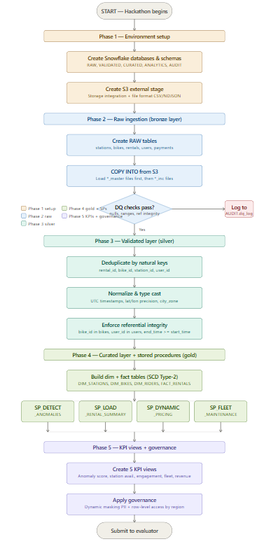

# 🚴 CityRide Smart Analytics Dashboard

An end-to-end **Data Engineering + Analytics project** built using **Snowflake + Streamlit** to analyze bike rental data in real-time using **Medallion Architecture (Bronze → Silver → Gold)**.

---

## 📌 Project Overview

CityRide Analytics is a scalable system that:

- Ingests real-time & batch data from AWS S3
- Processes data using Snowflake pipelines
- Implements Streams, Tasks, and SCD Type-2
- Applies Data Quality checks and anomaly detection
- Generates business KPIs
- Visualizes insights using Streamlit inside Snowflake

---

## 🏗️ Architecture
S3 → Snowflake (Bronze → Silver → Gold) → Streamlit Dashboard

### 🔹 Layers

- **Bronze Layer** → Raw data (no transformation)
- **Silver Layer** → Cleaned & validated data
- **Gold Layer** → KPI & analytics tables

---

## ⚙️ Tech Stack

- ❄️ Snowflake
- 🐍 Python (Snowpark)
- 📊 Streamlit
- ☁️ AWS S3
- 🔄 Snowpipe
- ⏱️ Streams & Tasks

---

## 🚀 Features

### ✅ Data Engineering
- Snowpipe for auto ingestion
- Streams for change data capture (CDC)
- Tasks for scheduling pipelines
- SCD Type-2 implementation

### ✅ Data Quality & Governance
- Data validation checks
- Anomaly detection (fraud, unrealistic rides)
- Risk scoring
- Dynamic Data Masking
- Row-Level Security

### ✅ Analytics KPIs
- 📊 Anomaly Rate
- 🔋 Fleet Health Score
- 👥 User Engagement Ratio
- 💰 Revenue by Channel
- 📍 Station Availability Score

### ✅ Dashboard
- KPI cards
- Bar charts & trends
- Filtering by channel
- Pipeline audit monitoring

---

## 📂 Project Structure
snowsurfers
|___Bike_rental_data
   |___app.py
   |___Bike_rental_data_usecase
   |___README.md

---

## 🖥️ Dashboard Features

- Real-time KPI display
- Revenue analysis charts
- Top station availability insights
- Pipeline audit reports
- Rental filtering by channel
- Engagement tracking

---

## 📊 Key SQL Concepts Used

- Window Functions (ROW_NUMBER)
- MERGE (SCD Type-2)
- Streams & Tasks
- Stored Procedures
- Aggregations & KPI calculations

---

## 🔐 Security Features

- Dynamic Data Masking (email, phone, GPS)
- Row-Level Access Control
- Role-based access

---

## 🔄 Pipeline Automation

- Auto ingestion using Snowpipe
- Incremental updates using Streams
- Scheduled execution using Tasks
- End-to-end automated pipeline

---

## 📈 KPIs

| KPI | Description |
|-----|------------|
| Anomaly Rate | % of suspicious rentals |
| Fleet Health | % of healthy bikes |
| Engagement Ratio | Active users (30 days) |
| Revenue | Avg revenue per channel |
| Availability | Station utilization |

---

## ▶️ How to Run

### 1️⃣ Setup Snowflake
- Create database, schemas, warehouse
- Configure S3 integration
- Run SQL scripts

### 2️⃣ Deploy Streamlit
- Upload `app.py` into Snowflake
- Use Snowpark session

### 3️⃣ Run Dashboard
- Open Streamlit app inside Snowflake

---

## 🎯 Use Cases

- Smart City Analytics
- Bike Sharing Systems
- Fraud Detection
- Real-time Monitoring

---

## 👨‍💻 Author

**SnowSurfers**  
Data Engineer | AI/ML Enthusiast

---

## ⭐ Support

If you like this project, give it a ⭐ on GitHub 🚀